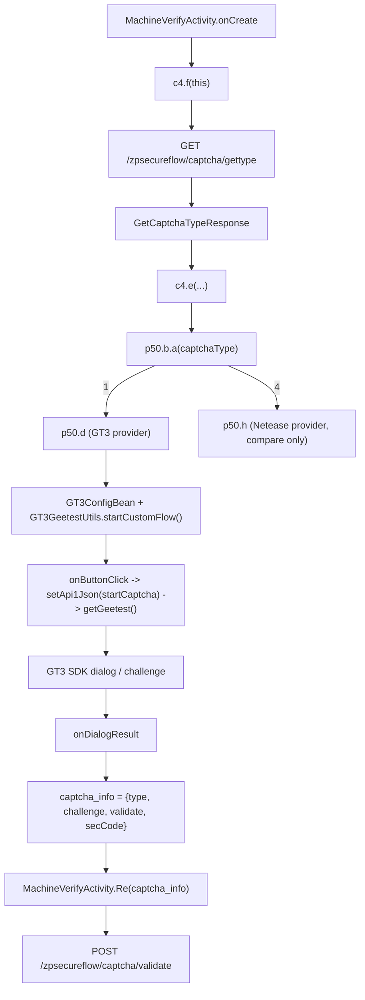

# GT3 极验模块静态取证与调用链分析

## Summary

这次只分析 GT3 极验分支，并把网易易盾当作统一验证码门面的对照分支。
结论先行：

1. GT3 的主体逻辑在 APK 的 dex 和 resources 中，有直接的 `com.geetest.sdk.*` 代码包、`gt3_*` 资源和业务接入层。
2. APK 内部存在一个“统一验证码门面”，由 `GetCaptchaTypeResponse.captchaType` 决定走 GT3 还是网易易盾。
3. `libyzwg.so` 不是 GT3 验证码逻辑本体；它通过 `com.twl.signer.YZWG` 参与通用请求签名、请求体编码与响应解码，验证码接口也只是复用了这条 signer 链。

## Artifacts

- APK: `/Users/haojiejack/github/drizzle-dumper-rust/artifacts/bosszhipin-reverse-project/input/base.apk`
- Native signer so: `/Users/haojiejack/github/drizzle-dumper-rust/artifacts/bosszhipin-reverse-project/native/lib/arm64-v8a/libyzwg.so`
- APK 反编译方式: `jadx`

## 静态证据矩阵

| 证据类别 | 位置 | 直接证据 | 说明 |
| --- | --- | --- | --- |
| GT3 SDK 存在 | `com.geetest.sdk.GT3GeetestUtils` | `getVersion() == "4.4.2.1"` | APK 内直接打包了 GT3 SDK，而不是只保留壳层接口。 |
| GT3 视图资源 | `res/layout/gt3_ll_geetest_view.xml` | `com.geetest.sdk.views.GT3GeetestView` | GT3 UI 资源直接进入 APK 资源表。 |
| GT3 等待页资源 | `res/layout/gt3_wait_progressdialog.xml` | `@string/gt3_geetest_checking`、`@drawable/gt3logo` | GT3 的等待态、logo 和提示文案都在资源内。 |
| 统一验证码返回体 | `net.bosszhipin.api.GetCaptchaTypeResponse` | `captchaType/startCaptcha/wyCaptchaId/wyCaptchaType` | 服务端返回 provider 类型和不同 provider 的启动参数。 |
| provider 选择工厂 | `p50.b.a(int)` | `1 -> new d()`、`4 -> new h()` | `captchaType == 1` 走 GT3，`captchaType == 4` 走网易易盾。 |
| GT3 provider | `p50.d` | `GT3GeetestUtils`、`GT3Listener`、`type = 1` | GT3 接入落点。 |
| 网易 provider 对照 | `p50.h` | `Captcha.getInstance()`、`type = 4` | 证明 APK 确实是统一门面而不是单一 GT3。 |
| 主链入口 | `MachineVerifyActivity` | `new c4(ir.a.f120141v3)` | 登录/机器验证主链从统一门面出发。 |
| gettype 接口 | `ir.a` | `zpsecureflow/captcha/gettype` | 主链先取 provider 类型。 |
| validate 接口 | `ir.a` + `MachineVerifyConfirmRequest` | `zpsecureflow/captcha/validate` + `captcha_info` | GT3 完成后把结果回送服务端确认。 |
| 次链入口 | `com.hpbr.bosszhipin.utils.z1` | `PostManMachineValidationRequest` -> `captchaType == 0 || 1` -> `k(startCaptcha)` | 另一条业务链也复用 GT3。 |
| signer Java 桥 | `com.twl.signer.YZWG` | `SoLoader.loadLibrary("yzwg")` + native encode/sign/decode | `libyzwg.so` 的 Java 层入口是通用 signer。 |
| signer 调用点 | `net.bosszhipin.base.m` | 生成 `sp`、`sig` 和加密 body | 验证码接口和其他接口共用签名链。 |
| native 负证据 | APK `lib/arm64-v8a/`、`libyzwg.so` | 没有 GT3/Netease 专用 `.so`；`libyzwg.so` stripped 且未见 `geetest/gt3/captcha` 直观符号/字符串 | GT3 主体不在 `libyzwg.so`。 |

## 关键证据摘录

### 1. GT3 SDK 与资源不是假入口

`com.geetest.sdk.GT3GeetestUtils` 直接给出版本号 `4.4.2.1`：

```java
public static String getVersion() {
    return "4.4.2.1";
}
```

来源：JADX 反编译 `com.geetest.sdk.GT3GeetestUtils`。

GT3 视图直接出现在资源布局中：

```xml
<com.geetest.sdk.views.GT3GeetestView
    android:id="@+id/geetest_view"
    android:layout_width="0dp"
    android:layout_height="wrap_content"/>
```

对应资源还包括：

- `res/layout/gt3_wait_progressdialog.xml`
- `res/layout/gt3_success_progressdialog.xml`
- `res/drawable/gt3logo.png`
- `res/drawable/gt3_new_bind_logo.gif`

这说明 GT3 的 UI/交互资源直接随 APK 分发。

### 2. APK 是统一验证码门面，不是只接了 GT3

`GetCaptchaTypeResponse` 明确带有多 provider 所需字段：

```java
public class GetCaptchaTypeResponse extends HttpResponse {
    public String captchaName;
    public int captchaType;
    public String randKey;
    public String startCaptcha;
    public String wyCaptchaId;
    public String wyCaptchaType;
}
```

`p50.b.a(int)` 把 `captchaType` 映射到 provider：

```java
public static e a(int i11) {
    return i11 != 1 ? i11 != 4 ? new a(i11) : new h() : new d();
}
```

其中：

- `p50.d` 是 GT3 provider，`e() == 1`
- `p50.h` 是网易 provider，`e() == 4`

所以后续分析 GT3 时，应该把统一门面当作入口，把网易分支当作对照项，而不是误以为 APK 只接了一家验证码。

## 主调用链

### 1. 业务入口

`MachineVerifyActivity` 在 `onCreate()` 中启动统一验证码流程：

```java
private final c4 f60199b = new c4(ir.a.f120141v3);

protected void onCreate(Bundle bundle) {
    ...
    this.f60199b.h(new b()).g(new a()).f(this);
}
```

这里的 `ir.a.f120141v3` 在常量表中被解析为：

```java
String strA17 = m.a("zpsecureflow/captcha/gettype");
f120141v3 = strA17;
String strA18 = m.a("zpsecureflow/captcha/validate");
f120143w3 = strA18;
```

### 2. 统一门面拉取 provider 类型

`c4.f(LActivity)` 会先发起 `GET /zpsecureflow/captcha/gettype`：

```java
public void f(LActivity lActivity) {
    lActivity.showProgressDialog("验证初始化中...");
    SimpleApiRequest.GET(this.f85336d).setRequestCallback(new a(lActivity)).execute();
}
```

成功后进入 `c4.e(...)`：

```java
private void e(LActivity lActivity, GetCaptchaTypeResponse getCaptchaTypeResponse) {
    p50.c cVar = new p50.c(getCaptchaTypeResponse);
    p50.e eVarA = p50.b.a(getCaptchaTypeResponse.captchaType);
    this.f85335c = eVarA;
    if (eVarA != null) {
        eVarA.a(lActivity, this.f85333a, cVar);
        this.f85335c.show();
    }
}
```

这一步完成了两件事：

1. 把服务端的 `GetCaptchaTypeResponse` 包装成 `p50.c`
2. 用 `captchaType` 选择 GT3 或网易 provider

### 3. GT3 provider 启动

`p50.d.show()` 初始化 GT3：

```java
public void show() {
    GT3ConfigBean gT3ConfigBean = new GT3ConfigBean();
    gT3ConfigBean.setPattern(1);
    gT3ConfigBean.setGt3ServiceNode(GT3ServiceNode.NODE_IPV6);
    gT3ConfigBean.setListener(new a(gT3ConfigBean));
    this.f130765d.init(gT3ConfigBean);
    this.f130765d.startCustomFlow();
}
```

GT3 真正取 challenge 的触发点在 `GT3Listener.onButtonClick()`：

```java
public void onButtonClick() {
    this.f130766b.setApi1Json(new JSONObject(d.this.f130764c.a()));
    d.this.f130765d.getGeetest();
}
```

这里的 `d.this.f130764c.a()` 返回的正是 `GetCaptchaTypeResponse.startCaptcha`。

也就是说：

- `/zpsecureflow/captcha/gettype` 返回 `startCaptcha`
- `startCaptcha` 被作为 `api1Json` 喂给 GT3 SDK
- GT3 SDK 再据此发起后续 challenge 流程

### 4. GT3 回调结果组装为 `captcha_info`

GT3 完成后进入 `p50.d$a.onDialogResult(String)`：

```java
JSONObject jSONObject = new JSONObject(str);
JSONObject jSONObject2 = new JSONObject();
jSONObject2.put("type", d.this.e());
jSONObject2.put("challenge", jSONObject.optString("geetest_challenge"));
jSONObject2.put("validate", jSONObject.optString("geetest_validate"));
jSONObject2.put("secCode", jSONObject.optString("geetest_seccode"));
d.this.f130764c.f130761b = jSONObject2.toString();
```

这里得到的 `captcha_info` 形态是：

```json
{
  "type": 1,
  "challenge": "...",
  "validate": "...",
  "secCode": "..."
}
```

随后通过 provider callback 回到 `MachineVerifyActivity`：

```java
public void a(p50.c cVar) {
    MachineVerifyActivity.this.Re(cVar.f130761b);
}
```

### 5. 服务端确认闭环

`MachineVerifyActivity.Re(String)` 发起确认请求：

```java
public void Re(String str) {
    MachineVerifyConfirmRequest machineVerifyConfirmRequest = new MachineVerifyConfirmRequest(new c());
    machineVerifyConfirmRequest.captcha_info = str;
    machineVerifyConfirmRequest.execute();
}
```

而 `MachineVerifyConfirmRequest` 的 URL 是：

```java
public String getUrl() {
    return ir.a.f120143w3;
}
```

也就是 `POST /zpsecureflow/captcha/validate`。

## 主调用链图



## 次级 GT3 链

`com.hpbr.bosszhipin.utils.z1` 还有另一条业务链复用 GT3：

```java
public z1 h() {
    PostManMachineValidationRequest postManMachineValidationRequest = new PostManMachineValidationRequest(new a());
    postManMachineValidationRequest.phone = com.twl.signer.a.f(this.f85862a.f85309b);
    postManMachineValidationRequest.type = this.f85862a.f85308a;
    postManMachineValidationRequest.execute();
    return this;
}
```

返回后在 `z1.f(PostManMachineValidationResponse)` 中分流：

```java
if (i11 == 0 || i11 == 1) {
    k(postManMachineValidationResponse.startCaptcha);
} else if (i11 == 4) {
    j(postManMachineValidationResponse.wyCaptchaId, postManMachineValidationResponse.wyCaptchaType);
}
```

GT3 分支由 `z1.k(String)` 拉起：

```java
this.f85864c = new GT3GeetestUtils(this.f85863b);
gT3ConfigBean.setListener(new b(gT3ConfigBean, str));
this.f85864c.init(gT3ConfigBean);
this.f85864c.startCustomFlow();
```

与主链的区别在于 `onDialogResult` 的回传格式：

```java
z1.this.f85862a
    .a(jSONObject.optString("geetest_challenge"))
    .i(jSONObject.optString("geetest_validate"))
    .g(jSONObject.optString("geetest_seccode"));
```

也就是说：

- 主链：组装 `captcha_info` JSON，再 POST `/zpsecureflow/captcha/validate`
- 次链：把 `geetest_challenge/geetest_validate/geetest_seccode` 直接写回业务对象 `b3`

## `libyzwg.so` 的参与方式

### 1. Java 桥入口

`com.twl.signer.YZWG` 通过 SoLoader 加载 `libyzwg.so`：

```java
SoLoader.loadLibrary(YZWG.LIB_NAME);
```

其中 `LIB_NAME = "yzwg"`。

它暴露的是一组通用 native 方法：

```java
private static native String nativeEncodeRequest(byte[] bArr, String str);
private static native byte[] nativeEncodeRequestBody(byte[] bArr, String str);
private static native byte[] nativeSignature(byte[] bArr, String str);
private static native byte[] nativeDecodeContent(String str, String str2);
private static native byte[] nativeDecodeContent(byte[] bArr, String str, int i11, int i12, int i13);
```

这组接口的语义很清楚：请求参数编码、请求体编码、签名和响应解码。

### 2. 实际调用点

`net.bosszhipin.base.m` 在构造请求时会调用这些 signer 包装：

```java
String strD2 = com.twl.signer.a.d(strD, secretKey);
bVar.w("sp", strD2);
bVar.w("sig", com.twl.signer.a.i(com.hpbr.bosszhipin.config.m.f(str) + strD, secretKey));
```

以及 batch/body 路径：

```java
byte[] bArrE = com.twl.signer.a.e(sf0.n.h(batchBodyBeanD), secretKey);
String strA = com.twl.signer.a.a(bArrE);
String strD2 = com.twl.signer.a.d(strD, secretKey);
bVar.w("sp", strD2);
bVar.w("sig", com.twl.signer.a.i(com.hpbr.bosszhipin.config.m.f(str) + strD + strA, secretKey));
```

这说明验证码接口并不是走一套单独的 native 验证码库，而是复用了全局请求签名/加密链。

### 3. native 负证据

对 APK 的 `lib/arm64-v8a/` 枚举结果：

- 共 56 个 `.so`
- 未发现名称中包含 `gee`、`gt3`、`captcha`、`netease`、`nis` 的验证码专用 native 库
- 存在 `libyzwg.so`、`libturingmfa.so`、`libzp-sdk-safety-face-detect.so` 等其他安全/风控相关库，但没有 GT3/Netease 专库

对 `libyzwg.so` 的直接观察结果：

- `file` 显示其为 `ELF 64-bit LSB shared object, ARM aarch64, stripped`
- `objdump -T` 只能看到通用动态符号，未见 `geetest/gt3/captcha` 相关导出名
- `strings -a` 检索 `geetest|gt3|captcha|netease|nis|wyCaptcha|challenge|seccode` 无命中

因此可以得出更稳妥的静态结论：

> GT3 验证码逻辑主体在 dex 和 resources 中；`libyzwg.so` 是通用 signer/codec native 库，不是 GT3 验证码引擎本体。

## 结论

### 已确认

1. APK 内真实打包了 GT3 SDK，版本号 `4.4.2.1`，并带有完整 GT3 资源与视图。
2. 主业务链是：
   - `MachineVerifyActivity`
   - `c4` 统一验证码门面
   - `GET /zpsecureflow/captcha/gettype`
   - `captchaType == 1 -> p50.d`
   - `startCaptcha -> GT3 api1Json`
   - `challenge/validate/secCode -> captcha_info`
   - `POST /zpsecureflow/captcha/validate`
3. 次级业务链 `z1` 也复用了 GT3，但结果不包装成 `captcha_info`，而是直接写入业务对象。
4. `libyzwg.so` 只负责通用签名/编码/解码，不是 GT3 核心验证码实现。

### 未在本轮静态分析中证明

- `startCaptcha` 的服务端 JSON 完整字段结构
- GT3 SDK 内部后续 WebView / challenge 请求的网络细节
- `libyzwg.so` 是否会对验证码接口做额外特判

这些都需要下一轮动态 hook 或抓包验证。

## 后续动态验证点

### 主链 hook 点

- `com.hpbr.bosszhipin.utils.c4.e(GetCaptchaTypeResponse)`
- `p50.b.a(int)`
- `p50.d.show()`
- `p50.d$a.onButtonClick()`
- `p50.d$a.onDialogResult(String)`
- `com.hpbr.bosszhipin.login.activity.MachineVerifyActivity.Re(String)`

### so / signer hook 点

- `com.twl.signer.a.d(String, String)`
- `com.twl.signer.a.e(String, String)`
- `com.twl.signer.a.i(String, String)`
- `com.twl.signer.YZWG.nativeEncodeRequest`
- `com.twl.signer.YZWG.nativeEncodeRequestBody`
- `com.twl.signer.YZWG.nativeSignature`

目标是观察：

- `/zpsecureflow/captcha/gettype` 的 `sp` / `sig`
- `/zpsecureflow/captcha/validate` 的 `sp` / `sig`
- GT3 回传后的 `captcha_info` 明文

### 次链 hook 点

- `com.hpbr.bosszhipin.utils.z1.h()`
- `com.hpbr.bosszhipin.utils.z1.f(PostManMachineValidationResponse)`
- `com.hpbr.bosszhipin.utils.z1.k(String)`
- `com.hpbr.bosszhipin.utils.z1$b.onDialogResult(String)`

目标是确认：

- `captchaType == 0 || 1` 是否都必然复用 GT3
- 次链是否只是主链的轻量变体，而不是另一套 provider 逻辑

